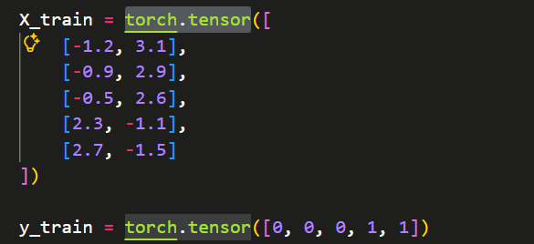
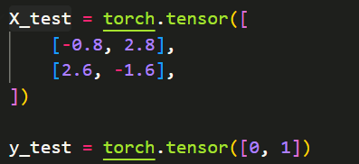

# Chloe's LLM from Scratch Notes 🚀
This is my personal notebook for studying "Build a Large Language Model from Scratch".
I will record my entire process of building a large language model from the ground up here, including code comments, troubleshooting logs, and learning insights.(why I use English? YOU know...just because I want to practice my English.)
---

## 26.04.18

* Today is the first time I am writing a note. I am very happy to share my learning experience, and I really enjoy the process of recording, so let's get started! 

### Regarding PyTorch:
 I am frustrated that I can no longer provide images for display and can only provide text descriptions. In fact, I encountered many problems when I first started configuring the PyTorch environment: CUDA version mismatch, which happened because I didn't proactively check my GPU configuration in PowerShell; the three libraries—torch, torchvision, and torchaudio—were installed separately, leading to version mismatches (yes... I blindly trusted an AI); and at the very beginning, I was configuring it in the system environment, which was just terrible! Make sure to configure it within a virtual environment.  To accommodate my "old" Python compiler, I foolishly chose to install a very old version of PyTorch, which ultimately resulted in not being able to call my GPU (I should explain: initially, I needed to configure CUDA for another project, which was in PyCharm); I then started installing the latest version of the Python compiler (3.14), but later it could not adapt to my CUDA during installation. These are all my mistakes, which you can use as a reference. 

### Solution: 
Sadly, almost all the AIs I used were unable to solve this big trouble perfectly (perhaps due to context and prompt issues); I finally resolved it with the help of the appendix in the book LLMs-from-scratch. I decisively followed the book's guidance to copy the installation command from the official PyTorch website and completed the verification work with the help of Gemini.

### My key steps:
1.Query the computer configuration in the terminal, focusing on the CUDA version in the upper right corner (for subsequent selection!)

2.Query the official website for the version that fits you and its corresponding command (the CUDA version cannot be higher than what your computer can accommodate)

3.Verify availability (verification in the terminal is also more reliable)


That is all for my insights on installing PyTorch. Since I have no experience and did not "back up" images, the production is relatively rough; I will gradually improve it. Additionally, my English is not very good, so my updates might be slow. Thanks for watching!


## 26.04.19

* I learned today about a multimodal capability that I suspect large models might utilize: chart plotting.

### First, let me introduce my learning strategy for code:

When I use AI to learn or understand a piece of code, I usually start with the imported libraries. I then look through each library to find where specific functions from those libraries are called. Next, I seek to understand the functionality of these functions. For code that is deeply nested and difficult to understand at once, I give it to the AI for a detailed explanation, and then I add my own comments (if you have Copilot, you can use that too! Though... I have run out of quota).

### Next, let's look at the knowledge I have acquired:

1.Imported Libraries: The data manipulation library pandas and the plotting library matplotlib. These are two very classic libraries used alongside PyTorch.

2.Functions Used: pandas.read_csv, matplotlib.pyplot, and matplotlib.ticker.

3.Functionality: pyplot calls many functions to handle the actual charting, saving images, and displaying them in pop-up windows; ticker is used to define the scale of the axes.

4.Learning and Commenting on Complex Parts: 


## 26.04.24

* Today, I learned about automatic differentiation. I share my Markdown notes on GitHub, feedback and corrections are welcome!

## 26.05.15

* Hello! Long time no see! Sorry for my delayed update — I had too much on my plate recently. You can find many other projects in my homepage repository. Don't worry, learning deep learning is a long journey — let's work hard together!
Because I think that Markdown is a little limited, I will record my learning process in this single note.

My current progress is at the data loader setup module. Here's how to understand a toy dataset: in neural network training, we need to split the data into input features and output labels. 
> The following code shows how to manually build a "toy dataset" for a binary classification task using PyTorch.
 

`X_train` (input data / independent variable): a 2D matrix of shape (5, 2).
 Rows: number of samples. There are 5 rows, meaning we have 5 different data samples.
 Columns: feature dimensions. There are 2 columns, meaning each sample is described by 2 feature values.

`y_train` (output data / dependent variable):a one-dimensional array containing 5 integers (shape: 5).
 These 5 numbers correspond one-to-one with the 5 samples in X_train, representing their class labels.
 The first three samples have label 0 (class 0), and the last two samples have label 1 (class 1), indicating that we are preparing data for a binary classification task.

>The following code corresponds to the code above. My first understanding was: X_test (test inputs) and y_test (test labels) serve as references to test whether the weight model updated after training is "better" and "more accurate" than before. Fortunately, this understanding is quite accurate.😄。


Why do we need this test set? After training the model, we need to evaluate whether the model has truly learned the underlying patterns behind the data, rather than just "memorizing" the training data (i.e., to avoid overfitting).

When evaluating the model with the test set, we only perform a forward pass to obtain predictions and compare them with the true `y_test` to calculate accuracy. **At this stage, backpropagation is absolutely not performed, meaning the model's weights will not be updated anymore.** Only when the model performs well on unseen data do we consider its weights to have been adjusted to an excellent, well-generalizing "good" state.

---
Regarding the `DataLoader`, it integrates the preparation work we just did. `batch_size=2` means that each time during training, 2 samples are taken from the 5×2 data matrix we just set up for training. The same applies to `test_dataloader`.
``` 
from torch.utils.data import DataLoader

torch.manual_seed(123)

train_loader = DataLoader(
    dataset=train_ds,
    batch_size=2, # how many samples per batch to load. In this case, we will load 2 samples at a time during training.
    shuffle=True, # whether to shuffle the data at the beginning of each epoch (recommended for training to improve generalization)
    num_workers=0 # number of subprocesses to use for data loading. 0 means that the data will be loaded in the main process (no parallelism).
)
```
Regarding `num_workers=0`:
Generally, we set `num_workers` greater than 0 to enable data loading on a separate thread, which improves training efficiency. However, since our dataset is relatively small and we are running in *Jupyter Notebook*, we keep it set to 0 to avoid potential errors.

That's all! Thank for your resding and welcome your correction!