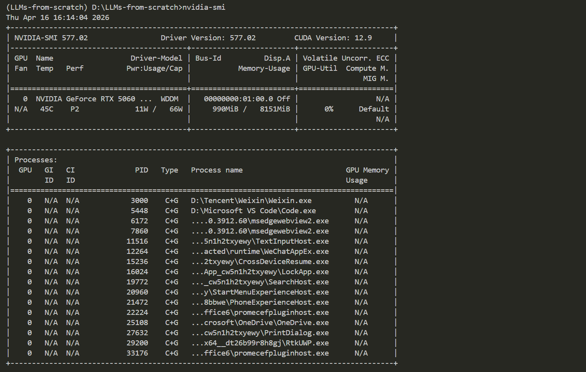
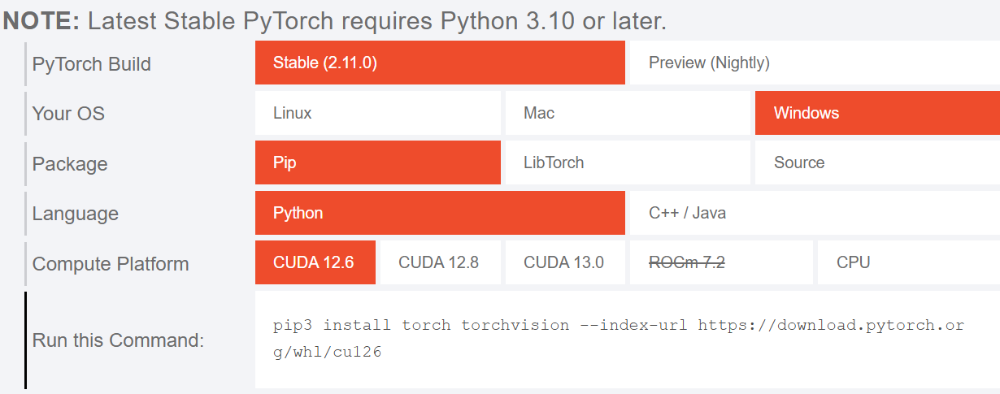
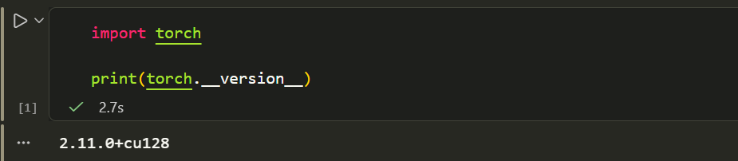

Chloe's LLM from Scratch Notes 🚀
This is my personal notebook for studying "Build a Large Language Model from Scratch".
I will record my entire process of building a large language model from the ground up here, including code comments, troubleshooting logs, and learning insights.(why I use English? YOU know...just because I want to practice my English.)

26.04.18

Today is the first time I am writing a note. I am very happy to share my learning experience, and I really enjoy the process of recording, so let's get started! 

Regarding PyTorch: I am frustrated that I can no longer provide images for display and can only provide text descriptions. In fact, I encountered many problems when I first started configuring the PyTorch environment: CUDA version mismatch, which happened because I didn't proactively check my GPU configuration in PowerShell; the three libraries—torch, torchvision, and torchaudio—were installed separately, leading to version mismatches (yes... I blindly trusted an AI); and at the very beginning, I was configuring it in the system environment, which was just terrible! Make sure to configure it within a virtual environment.  To accommodate my "old" Python compiler, I foolishly chose to install a very old version of PyTorch, which ultimately resulted in not being able to call my GPU (I should explain: initially, I needed to configure CUDA for another project, which was in PyCharm); I then started installing the latest version of the Python compiler (3.14), but later it could not adapt to my CUDA during installation. These are all my mistakes, which you can use as a reference. 

Solution: Sadly, almost all the AIs I used were unable to solve this big trouble perfectly (perhaps due to context and prompt issues); I finally resolved it with the help of the appendix in the book LLMs-from-scratch. I decisively followed the book's guidance to copy the installation command from the official PyTorch website and completed the verification work with the help of Gemini.

My key steps:
1.Query the computer configuration in the terminal, focusing on the CUDA version in the upper right corner (for subsequent selection!)

2.Query the official website for the version that fits you and its corresponding command (the CUDA version cannot be higher than what your computer can accommodate)

3.Verify availability (verification in the terminal is also more reliable)

That is all for my insights on installing PyTorch. Since I have no experience and did not "back up" images, the production is relatively rough; I will gradually improve it. Additionally, my English is not very good, so my updates might be slow. Thanks for watching!